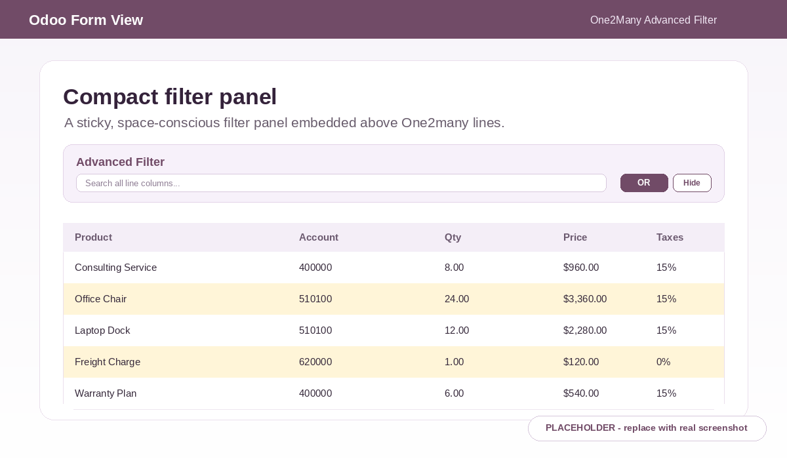
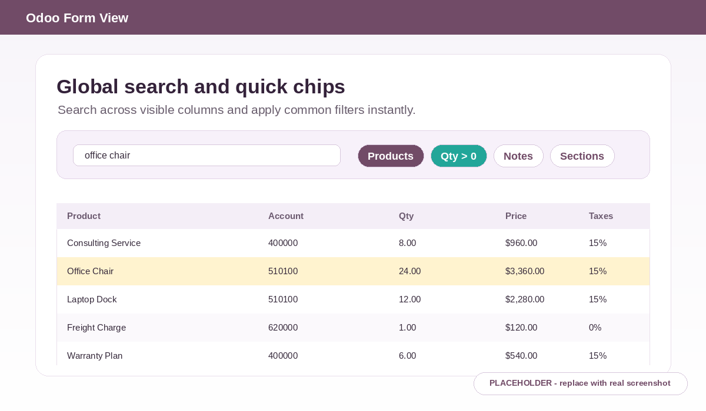
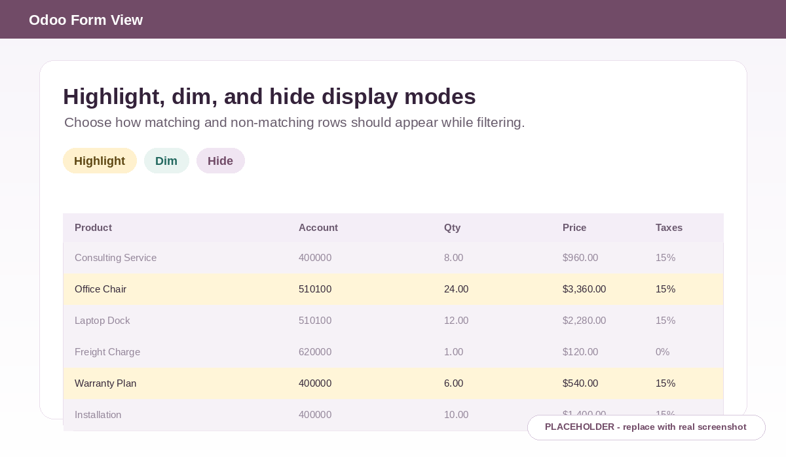
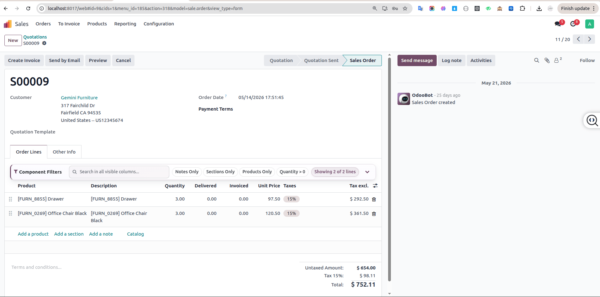

# One2Many Advanced Filter

## Smart Embedded Filtering for Odoo One2many Lines

**One2Many Advanced Filter** brings a fast, native-style filtering panel directly into Odoo One2many list views. It helps users find the exact lines they need without leaving the form view, reloading the page, or changing the underlying business data.

Use it on invoices, sales orders, purchase orders, stock operations, BOMs, and custom One2many lists where users need to work efficiently with large line datasets.

---

## The Problem

Standard Odoo One2many lists are simple and reliable, but they can become difficult to use when business documents contain many lines.

Common examples include:

- Large customer invoices with many invoice lines
- Sales orders with hundreds of products or service lines
- Purchase orders with long vendor line lists
- Inventory operations with many stock move lines
- Manufacturing BOMs with many components
- Custom ERP forms with dense One2many records

In these cases, users often need to manually scroll through hundreds of rows just to find a product, account, quantity, price, date, note, section, or custom field value. Standard embedded One2many lists do not provide an advanced inline filtering experience inside the form itself.

---

## Why This Module?

This module adds smart filtering directly inside One2many lists, giving users a familiar Odoo-like experience without disrupting their workflow.

Users can filter, search, highlight, dim, or hide lines while staying on the same form view. The filter runs in the browser UI, so the original One2many data remains untouched and no backend write is performed.

---

## Features

### ✅ Dynamic Field Filtering

Filter by any available supported field shown in the One2many list, including:

- Product
- Account
- Analytic
- Quantity
- Price
- Dates
- Selection fields
- Boolean fields
- Many2one fields
- Custom fields

The field picker is dynamic and reads the available visible columns from the current One2many list.

### ✅ Multiple Operators

Use field-aware operators based on the selected field type.

**Text operators**

- contains
- not contains
- starts with
- ends with
- =
- !=

**Number operators**

- >
- <
- >=
- <=
- =
- !=

**Date operators**

- before
- after
- equal
- not equal

**Boolean operators**

- True
- False

### ✅ Multiple Conditions

Build more precise filters with multiple rules:

- AND logic
- OR logic

This makes it easy to find lines that match either broad search scenarios or strict business conditions.

### ✅ Global Search

Search across all visible One2many columns from one compact input.

- Search across visible columns
- Fast inline search
- No page reload
- Debounced input for a smoother user experience

### ✅ Quick Filter Chips

Apply common filters instantly with quick chips:

- Notes Only
- Sections Only
- Products Only
- Quantity > 0

Quick chips are shown only when the current One2many list supports the related fields.

### ✅ Display Modes

Choose how matching and non-matching rows should appear:

- Hide Non-Matching Lines
- Highlight Matching Lines
- Dim Non-Matching Lines

This allows each user to choose between a focused view or a visual review mode.

### ✅ Sticky Filter Panel

The filter panel remains accessible while scrolling through long One2many lists, so users do not need to jump back to the top of the form to adjust filters.

### ✅ Compact Modern UI

The interface is designed to feel natural inside the Odoo backend:

- Native Odoo look
- Compact layout
- Modern SaaS-inspired styling
- Responsive behavior for smaller screens
- Clear controls for search, conditions, logic, and display mode

### ✅ Result Counter

The panel shows a live result summary, for example:

```text
Showing X of Y lines
```

This helps users immediately understand how many lines match the current filter.

### ✅ Section & Note Support

The module supports Odoo display lines:

- `line_section`
- `line_note`

It can filter sections, notes, product lines, and regular lines while preserving useful context for section-based lists.

### ✅ Generic Architecture

The implementation is generic and works with any supported One2many list view.

It is not limited to a single business model and can be used across standard Odoo apps and custom modules.

---

## Performance

One2Many Advanced Filter is designed to be lightweight and fast.

- No RPC calls during filtering
- No database writes
- No page reloads
- UI-only filtering
- Original One2many data remains untouched
- Optimized for large datasets
- Lightweight Owl implementation
- Uses cached comparable values for efficient repeated filtering

Filtering happens in the browser on the currently loaded One2many records. The module changes how rows are displayed in the UI; it does not modify, unlink, or save any records.

---

## Supported Models

The module is generic and can work with standard and custom One2many line models, including:

- `account.move.line`
- `sale.order.line`
- `purchase.order.line`
- `stock.move.line`
- `mrp.bom.line`
- Custom One2many models

---

## Screenshots

### Compact Filter Panel



### Global Search & Quick Filters



### Display Modes



---

## Live Demo



---

## Installation

1. Copy the module folder into your Odoo custom addons directory.
2. Restart the Odoo server.
3. Activate Developer Mode.
4. Go to **Apps**.
5. Click **Update Apps List**.
6. Search for **One2Many Advanced Filter**.
7. Install the module.

No additional Python dependency is required.

---

## Compatibility

Compatible with:

- Odoo 17
- Odoo 18
- Odoo 19

---

## Technical Notes

- Module technical name: `custom_one2many_advanced_filter`
- Dependency: `web`
- Frontend framework: Owl
- License: LGPL-3
- Filtering scope: currently loaded One2many list records
- Data safety: display-only filtering, no automatic writes

---

## Roadmap

Planned future enhancements:

- Saved Filter Presets
- Favorites
- Filter History
- Column Visibility
- Export Filtered Data
- Group By
- Aggregations
- Advanced Logic Builder
- AI Smart Search

---

## License

This module is licensed under **LGPL-3**.

---

## Stop Scrolling. Start Filtering.

One2Many Advanced Filter helps Odoo users review large embedded datasets faster, reduce manual scrolling, and stay focused inside the form view.

Improve productivity across invoices, sales orders, purchase orders, inventory operations, BOM components, and custom ERP workflows with smart embedded filtering for One2many lines.
